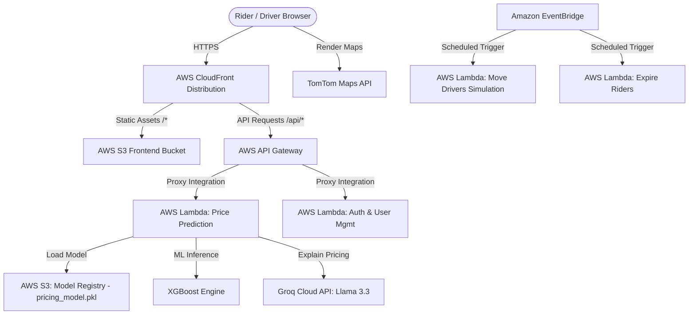
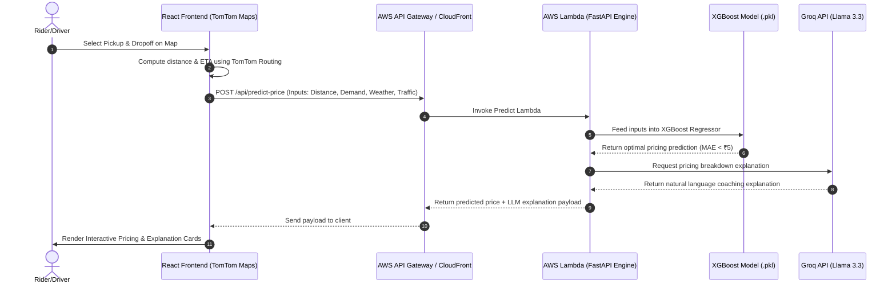

# 🚖 DynamicPrice | AI-Powered Dispatch & Serverless Pricing Engine

A state-of-the-art, end-to-end ride-sharing dispatch and pricing simulation platform. The system leverages real-time demand signals, weather indexes, and traffic conditions to predict optimal ride prices using **XGBoost Regression**, and generates contextual, human-readable explanations via **Llama 3.3**. The application is architected to run locally using **FastAPI** or fully serverless on **AWS**.

---

## 🏗️ System Architecture

The application is built on a highly decoupled serverless architecture designed for high availability, low latency, and zero server maintenance overhead.



### ☁️ AWS Infrastructure Details
* **Frontend Hosting**: React static build hosted on **Amazon S3** with public access disabled (secured via Origin Access Control).
* **Global Content Delivery**: **Amazon CloudFront** caches static frontend assets globally, manages SSL termination, and acts as a single-entry point routing `/api/*` requests directly to backend services.
* **Serverless Backend APIs**: **Amazon API Gateway** maps incoming HTTP requests to corresponding **AWS Lambda** instances running asynchronous Python handlers.
* **Periodic Background Tasks**: **Amazon EventBridge** CRON rules trigger Lambdas (e.g., driver movement simulation and passenger expiry routines) at regular intervals to maintain simulation state.

---

## ⚡ Interactive Pricing Flow



---

## 🛠️ Tech Stack

| Layer | Technologies | Description |
| :--- | :--- | :--- |
| **Frontend** | React.js, Custom CSS, TomTom Maps SDK | Interactive UI, route planning, real-time demand/surge heatmaps. |
| **Backend** | FastAPI, Uvicorn, Python AsyncIO | High-performance, asynchronous REST API gateway. |
| **Machine Learning**| XGBoost, Scikit-Learn, Pandas, NumPy | Regression modeling trained on 12,000+ ride data rows ($R^2 > 0.99$). |
| **GenAI** | Groq Cloud API, Llama 3.3 | Generates natural language pricing breakdowns and driver earning tips. |
| **Deployment & Cloud**| AWS S3, CloudFront, Lambda, API Gateway | Serverless deployment scripts, edge routing, and automated asset cache invalidations. |

---

## 📈 Machine Learning Pricing Model

The dynamic pricing engine is powered by an **XGBoost Regressor** trained on a synthetically generated dataset of over 12,000 real-world ride-sharing scenarios.

### Feature Weights & Inputs
The model is trained on the following features:
1. **Distance (km)** & **ETA (minutes)** (calculated via TomTom routing API).
2. **Demand-Supply Ratio** (Riders requesting rides vs. Drivers available in the zone).
3. **Weather Index** (Multiplier ranging from clear weather to severe thunderstorm surcharges).
4. **Traffic Congestion Index** (Multiplier ranging from free-flow to severe gridlock delays).
5. **Ride Mode** (Discounted Shared Rides vs. Premium Solo Rides).

### Model Performance Metrics
* **$R^2$ Score**: `> 0.995` (representing near-perfect learning of compound multipliers).
* **Mean Absolute Error (MAE)**: `< ₹5` deviation from theoretical pricing rules.

---

## ⚙️ Local Setup & Running

### 1. Prerequisites
Ensure you have the following installed:
* Python 3.10+
* Node.js 16+

### 2. Backend Setup
1. Navigate to the backend directory:
   ```bash
   cd dynamic-pricing/Backend
   ```
2. Install Python dependencies:
   ```bash
   pip install -r requirements.txt
   ```
3. Set your environment variables in `.env` file (e.g. `GROQ_API_KEY`).
4. Start the FastAPI development server:
   ```bash
   uvicorn main:app --reload --port 8000
   ```

### 3. Frontend Setup
1. Navigate to the frontend directory:
   ```bash
   cd dynamic-pricing
   ```
2. Install Node packages:
   ```bash
   npm install
   ```
3. Run the development server:
   ```bash
   npm start
   ```

---

## 🚀 AWS Serverless Deployment Steps

Automatic deployment helper scripts are provided in the `/dynamic-pricing` directory:

1. **Deploy backend infrastructure (Lambdas & Gateway)**:
   ```bash
   bash lambda_functions/deploy_phase2.sh YOUR_ACCOUNT_ID
   ```
2. **Deploy frontend static storage**:
   ```bash
   bash s3_frontend.sh YOUR_ACCOUNT_ID
   ```
3. **Setup Edge CDN and Cache routing**:
   ```bash
   bash cloudfront_setup.sh YOUR_ACCOUNT_ID YOUR_API_GATEWAY_ID
   ```
4. **Perform final build and URL integration**:
   ```bash
   bash final_deploy.sh YOUR_ACCOUNT_ID YOUR_CF_DOMAIN YOUR_DIST_ID
   ```
